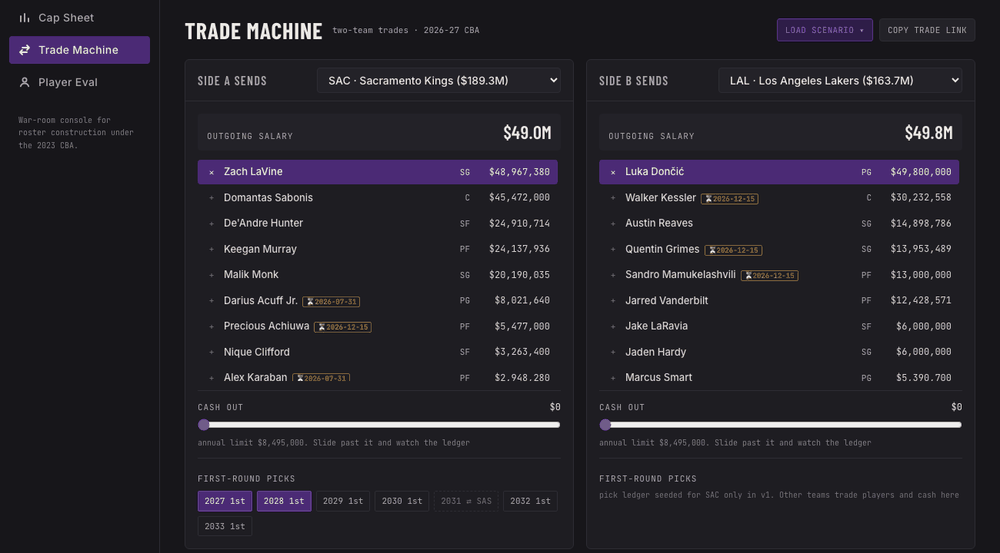
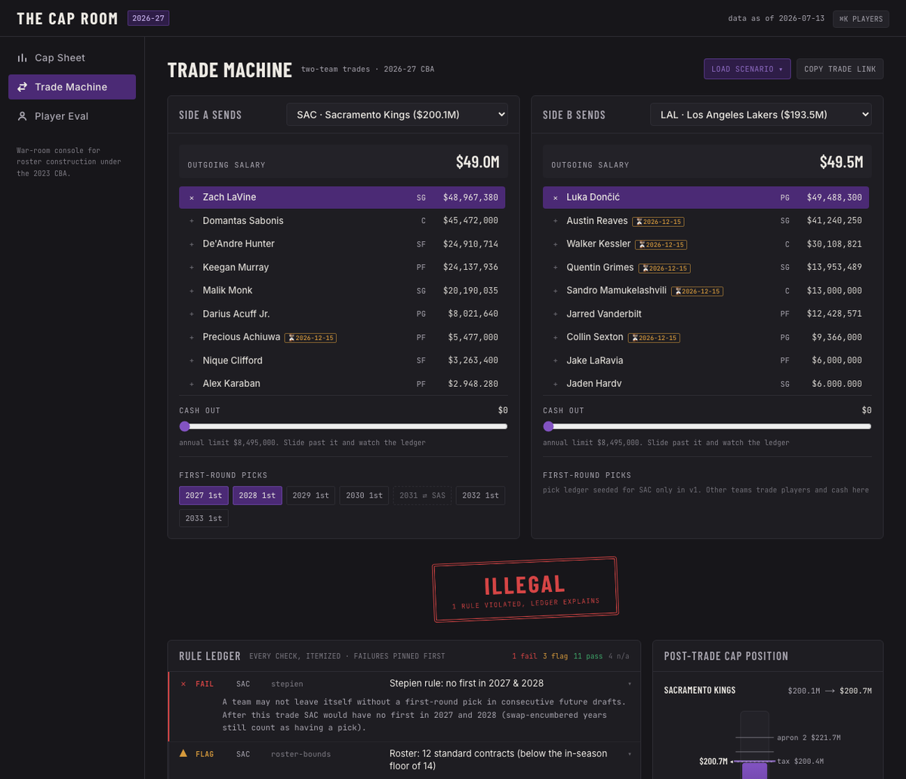
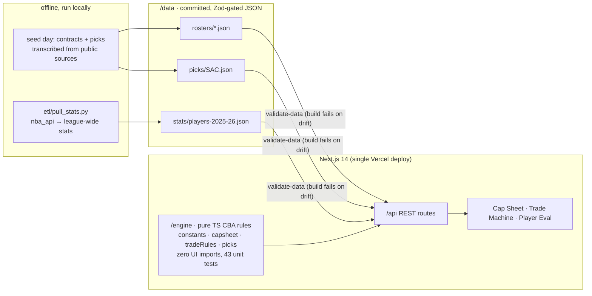

# THE CAP ROOM

**Live: [the-cap-room.vercel.app](https://the-cap-room.vercel.app)**

**A front-office console for NBA roster construction under the 2023 CBA.**
Cap sheets against the five lines, a trade machine whose verdicts explain
themselves rule by rule, and league-percentile player evaluation. Built as an
engineering demo for the Sacramento Kings' Basketball Software Engineer role.



*The Dončić test: LaVine plus the 2027 and 2028 firsts fails on the Stepien
rule with the reason written out; swap the 2028 pick for 2029 and it stamps
LEGAL. Load it in one click from the Trade Machine's scenario menu, or press
⌘K anywhere to jump to a player.*


---

## Why it looks like this

Three modules over one pure rules engine:

- **Cap Sheet**: team salary as a level gauge against floor / cap / tax /
  first apron / second apron, dollar distances to each, three years of
  committed money, and which exceptions are live *including the hard cap each
  one would trigger*.
- **Trade Machine**: the flagship. Build a two-team deal (players, cash,
  SAC's first-round picks) and get the **Rule Ledger**: every CBA check the
  engine ran, pass or fail, with the arithmetic in plain English. A silent
  red X is a product failure here: illegal trades cite the rule and the
  numbers. Legal trades that create hard caps say so. Proposals live in the
  URL, so any trade is a shareable link.
- **Player Eval**: contract-aware cards with 2025-26 league percentiles
  (computed against all qualified players, not just the seeded teams) and a
  compare radar for 2–4 players.



## Architecture



**The engine is the product.** `/engine` is pure TypeScript, with no React, no
Next.js, and no I/O, so the CBA logic can be read and audited in one sitting and
tested without ceremony. The UI consumes the app's own REST API.

### The stats.nba.com gotcha

stats.nba.com blocks cloud-provider IPs, and Spotrac has no public API. So the
deployed demo makes **zero runtime calls** to either: `etl/pull_stats.py` runs
locally (three rate-limited league-wide requests), writes a versioned snapshot
with a `pulledAt` stamp, and the snapshot is committed. Same posture for
contracts: transcribed from Spotrac on seed day with URL + access
date recorded per team in [`docs/sources.md`](docs/sources.md).

### Data honesty

- Every roster file carries the source's **published team total**, and
  `npm run validate:data` re-sums the seeded players through the engine;
  the build fails unless they match **to the dollar** (all 7 teams do).
- Unknown values are surfaced as *unknown*, never invented; unsigned cap
  holds and pending deals are excluded (see "Known gaps" in `docs/sources.md`).
- The footer's "data as of" date is load-bearing: July rosters move fast.

## Run it

```bash
npm install
npm test              # 43 engine tests: golden CBA scenarios
npm run validate:data # schema + published-total gate (also runs pre-build)
npm run dev           # http://localhost:3000
```

Refresh the stats snapshot (from a residential connection):

```bash
cd etl && python3 -m venv .venv && .venv/bin/pip install -r requirements.txt
.venv/bin/python pull_stats.py
```

## API

The UI consumes these routes; they're plain REST and curl-able:

```bash
# every seeded team with cap position
curl -s localhost:3000/api/teams | jq '.teams[0]'

# a full engine-computed cap sheet
curl -s localhost:3000/api/teams/SAC/capsheet | jq '{totalSalary, status, exceptions: [.exceptions[].name]}'

# player search
curl -s 'localhost:3000/api/players?team=SAC&q=mur' | jq '.players[].name'

# validate a trade → full rule ledger
curl -s -X POST localhost:3000/api/trade/validate \
  -H 'content-type: application/json' \
  -d '{
    "leagueYear": "2026-27",
    "sides": [
      {"team": "SAC", "playerIds": ["203897"], "pickIds": ["SAC-2027-1st", "SAC-2028-1st"]},
      {"team": "LAL", "playerIds": ["1629029"]}
    ]
  }' | jq '{legal, fails: [.checks[] | select(.status=="fail") | .headline]}'
# → { "legal": false, "fails": ["Stepien rule: no first in 2027 & 2028"] }
```

## Rules implemented (v1 = two-team trades)

| Rule | Behavior |
|---|---|
| Salary matching below the aprons | `max(125% + $250K, min(200% + $250K, out + $9,096,000))` |
| Cap-room absorption | teams finishing under the cap skip percentage matching |
| First-apron teams | take back ≤ 100% of outgoing |
| Second-apron teams | ≤ 100%, no aggregating two salaries, no sending cash |
| Hard-cap triggers | >100% take-back → capped at apron 1; aggregation or cash → apron 2 (surfaced as warnings with the exact copy an analyst would want) |
| Roster bounds | > 15 standard contracts fails; < 14 warns; ≤ 3 two-ways |
| Two-way contracts | tradeable, but excluded from matching and team salary; the ledger calls out when counting one would have made the math work |
| Cash | $8,495,000 annual send/receive limits, tracked separately |
| Stepien rule | no consecutive future drafts without a first; swap-encumbered years still count as having a pick |
| Player restrictions | no-trade (consent warning), recently-signed (blocked until the seeded date), cannot-aggregate |

Boundary semantics are strict-greater and tested at the dollar: a team at
exactly $209,015,000 is *not* a first-apron team; at $209,015,001 it is.

## Known simplifications (named on purpose)

Three-team trades · base-year compensation · existing TPEs · poison-pill
provisions · aggregation waiting periods after acquisition · incentive/bonus
cap-hit variance · sign-and-trade construction · pre-existing hard caps
(e.g. LAL's from the Kessler S&T) · future-cap projections · pick ledgers for
non-SAC teams. The aggregation test in v1: a team aggregates when its return
exceeds the allowance generated by its largest single outgoing salary.

## Repo map

```
engine/            pure CBA engine + __tests__ (read this first)
data/              rosters · picks · stats · Zod-gated snapshots
lib/data/          schemas + loaders
app/api/           REST routes over the engine
app/ components/   the three modules + shell
etl/               pull_stats.py + requirements.txt
docs/sources.md    every figure's URL + access date
docs/production-notes.md   Postgres schema + ingestion DAG sketch
```

---

Unofficial demo by Adelson Aguasvivas. Not affiliated with the Sacramento
Kings or the NBA. No team or league marks; data as of 2026-07-13.
